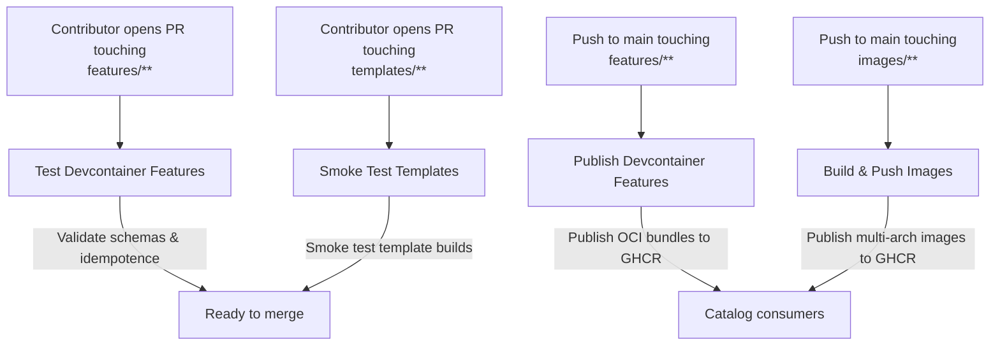
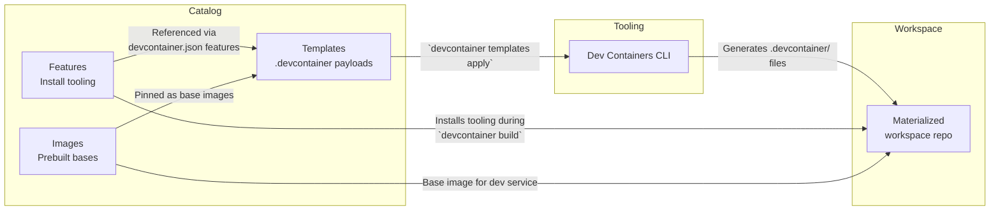

# Airnub DevContainers Catalog

[](https://github.com/airnub-labs/devcontainers-catalog/actions/workflows/ci-cli-test.yml)
[](https://github.com/airnub-labs/devcontainers-catalog/actions/workflows/ci-coverage-report.yml)
[](https://airnub-labs.github.io/devcontainers-catalog/)
[](https://github.com/airnub-labs/devcontainers-catalog/security)
[](./LICENCE)

**Primitives:**
- **Features** → install tooling (Supabase CLI, Node, CUDA, etc.). No services, idempotent.
- **Templates** → ship a ready-to-use `.devcontainer/` payload (can be multi-container via Compose).
- **Images** → prebuilt base(s) to speed builds.

> ⚙️ **Local setup note:** before hacking on the catalog, check the [Prerequisites](CONTRIBUTING.md#prerequisites) for `make check` so the validation suite passes on your machine.

> There’s no formal **“Stack”** object in the devcontainers spec. In this catalog, a **stack** is just a **flavor of Template** that combines features + sidecars + ports into a tested combo.

## What’s in this repo

### Feature catalog highlights

- [README Auto-Setup (Runme Agent)](src/runme-agent/README.md) — install Runme, expose the `airnub-autosetup` helper, and optionally delegate failures to an available coding agent. Enable it from the Codespaces/Dev Containers “Add Features…” picker or by referencing `ghcr.io/airnub-labs/devcontainers-catalog/runme-agent` in your `devcontainer.json`.

## Generator + Manifest Contract

- `tools/catalog-generator/` exposes `generateCatalogWorkspace` and a `catalog-generate` CLI that materialises provider-agnostic workspaces.
- `packages/schema/` publishes the `@airnub/devcontainers-catalog-manifest` schema and TypeScript helpers.
- Every generated workspace includes a `manifest.json` describing ports, sidecars, and safety notes, plus a `/classroom-browser` directory and README guidance on passwords + Private ports.
- `catalog/sidecars.json` tracks browser sidecars and the environment variables they require.

- `features/` — Install-only, idempotent add-ons. No services baked in.
- `templates/` — **Dev Container Templates (scaffolds)** you copy into a repo (follow the Dev Container Template spec with `devcontainer-template.json`).
- `images/presets/` — **Prebuildable image presets**. Each folder contains a `devcontainer.json` used by `devcontainer build` to bake/publish a fast-start image to GHCR.
- `images/dev-base/` — A thin base on top of `mcr.microsoft.com/devcontainers/base` with overridable build args.
- `docs/` — Guides, architecture notes, and CI examples.

## If you only have 5 minutes

```mermaid
flowchart LR
    A[Pick manifest or template] -->|Flexible (Feature) Mode| B(devcontainer templates apply)
    A -->|Fast (Prebuilt) Mode| C(devc generate → devc build → devc scaffold)
    C --> D[Students pull prebuilt image]
    B --> E[Local + Codespaces run same compose]
```

- **Flexible mode** → apply templates directly when you want to hand-tune features or Compose fragments. See the parity checklists inside each template README.
- **Fast mode** → declare `spec.base_preset` in a manifest, run `devc generate`, and ship the prebuilt image + scaffold for instant Codespaces starts.

## Quick-start tiles

| Persona | Flow | Commands | Cold / warm timing |
| --- | --- | --- | --- |
| I’m a **teacher on iPad** | Fast (Prebuilt) lesson | `devc generate examples/lesson-manifests/intro-ai-week02.yaml --out-images images/presets/generated --out-templates templates/generated`<br>`devc build --ctx images/presets/generated/airnub-intro-ai-week02 --tag ghcr.io/airnub-labs/templates/lessons/airnub-intro-ai-week02:ubuntu-24.04-airnub-intro-ai-week02-v1`<br>`devc scaffold examples/lesson-manifests/intro-ai-week02.yaml --out workspaces/intro-ai-week02` | ~2 min cold to first Codespace; <1 min warm once image cached |
| I’m an **advanced dev** | Flexible template tweaks | `devcontainer templates apply --template-id ghcr.io/airnub-labs/devcontainer-templates/stack-nextjs-supabase-webtop:1.0.0 --workspace-folder .`<br>`devc add service supabase redis` | Depends on features; 3–4 min first build, <30 s reopen |
| I’m **offline** today | Generate scaffold + aggregate compose | `devc generate examples/lesson-manifests/intro-ai-week02.yaml --out-images ./offline/images --out-templates ./offline/templates --force`<br>`docker compose -f ./offline/images/airnub-intro-ai-week02/aggregate.compose.yml up -d` | ~5 min for first build on laptop |

## Source vs Artifact (Templates vs Presets)

- **templates/** = **SOURCE scaffolds** (Dev Container Templates per spec).
  Copy a `.devcontainer/` into your repo for flexible, per-repo edits.

- **images/presets/** = **ARTIFACT build contexts** used to **prebuild OCI images** (published to GHCR).
  External workspaces reference these prebuilt images for **fast, identical starts** (Codespaces & local Docker).

**Classroom tip:** Prefer **prebuilt lesson images** for students (no feature re-installs). Instructors select service fragments (Redis, Supabase, Kafka/KRaft, Airflow, Prefect, Dagster, Temporal, Webtop/CDP) and the generator emits an **aggregate compose** so the whole stack runs with one command.

See: [docs/getting-started/classroom-quick-start.md](docs/getting-started/classroom-quick-start.md) · [docs/vision/saas-edu-platform-vision.md](docs/vision/saas-edu-platform-vision.md)

---

## 📚 Documentation

**Quick Links:**
- 🚀 **[Fast Classroom Setup](docs/getting-started/classroom-quick-start.md)** - Get students coding in <2 minutes
- 🏗️ **[Architecture Overview](docs/architecture/README.md)** - System design and principles
- 📖 **[Full Documentation Hub](docs/README.md)** - Complete documentation index
- 🔮 **[MVP Strategy](docs/mvp/README.md)** - Current strategic direction

**Key Principles:**
- ⭐ **[Separation of Concerns](docs/architecture/separation-of-concerns-devcontainers-vs-comhra.md)** - Catalog is education-agnostic, stateless generator
- **[Dev Environments Strategy](docs/mvp/dev-environments-strategy.md)** - Provider-agnostic design (local Docker, Codespaces, etc.)
- **[Manifest Authoring](docs/getting-started/manifest-authoring.md)** - Declarative, reproducible environments

**For Contributors:**
- [Contributing Guide](CONTRIBUTING.md) - How to contribute
- [Development Setup](docs/contributing/development.md) - Get your dev environment ready
- [Testing Guidelines](docs/contributing/testing.md) - Testing standards

---

## Templates ↔ presets map

| Template (source) | Matching preset (artifact) | When to reach for the template | When to reach for the preset |
| --- | --- | --- | --- |
| `templates/base` | `images/presets/full` | You want a minimal scaffold to add bespoke Features/Compose fragments. | You need a full-toolchain base (Node + pnpm + Python) prebuilt for fast student startups. |
| `templates/web` | `images/presets/node-pnpm` | Experiment locally with Chrome CDP + Supabase features. | Publish a headless web workspace so learners avoid reinstalling Node/pnpm. |
| `templates/nextjs-supabase` | `images/presets/node-pnpm` | Customise Next.js scaffolding flags before committing. | Ship a prebuilt Next.js + Supabase lesson image. |
| `templates/stack-nextjs-supabase-novnc` | `images/presets/node-pnpm` | Toggle Redis/GUI providers for bespoke stacks. | Push a ready-to-run stack with GUI + Supabase for Codespaces/iPad learners. |
| `templates/stack-nextjs-supabase-webtop` | `images/presets/node-pnpm` | Mix and match GUI providers locally. | Deliver a full desktop + Supabase stack in a single prebuilt image. |
| `templates/stack-web-node-supabase-webtop` | `images/presets/node-pnpm` | Customise CLI bundles or service mix. | Hand students a Node/Supabase desktop that boots instantly. |
| `templates/classroom-studio-webtop` | `images/presets/full` | Adjust Chrome policies or Compose overrides. | Provide a turnkey studio desktop with policies baked in. |
| `templates/classroom-webtop` | `images/presets/full` | Layer additional sidecars before sharing. | Publish a fast-start desktop-first lesson image. |
| `templates/classroom-chrome-cdp` | `images/presets/node-pnpm` | Iterate on headless automation locally. | Deliver a headless Chrome CDP environment with preinstalled tooling. |
| `templates/classroom-linux-chrome` | `images/presets/full` | Prototype headful Chrome wiring. | Roll out a managed browser once the vetted image ships. |

## Using stacks (templates)

You can **materialize** a template’s payload (`.template/.devcontainer/*`) into a workspace repo, or reference a prebuilt image + features.

**Examples:**
- `templates/stack-nextjs-supabase-webtop/`
- `templates/stack-web-node-supabase-webtop/`

Each stack template specifies:
- `dockerComposeFile` (e.g., `dev` + `redis` + GUI sidecar `webtop`/`novnc`)
- port labels (9222 CDP, 3001/6080 desktop, 6379 Redis)
- feature set (Node, Supabase CLI, agent-tooling CLIs, etc.)

## Where do Supabase/Redis live?

- In **stack templates** via Compose sidecars and/or CLI-managed local via a Feature and `postStart` helper.
- Prefer Supabase **CLI-managed local**; provide a separate template flavor for a fully containerized Supabase stack when needed.

## Secrets flow at a glance

| Context | Where secrets live | Notes |
| --- | --- | --- |
| Local development | `.devcontainer/.env.defaults` (non-secret defaults) + `.env` (ignored) | `devc generate` writes `.env.example` so teammates know which keys to provide locally. |
| GitHub Codespaces | Codespaces / repository secrets injected as environment variables | Map manifest `spec.secrets_placeholders` to secrets (e.g., `SUPABASE_ANON_KEY`) and consume via `.devcontainer/.env.example`. |
| Classroom SaaS | Platform vault + manifest metadata | MCP agents request secrets from the SaaS vault; nothing is baked into presets or templates. |

## Minimal taxonomy

- **Feature** = “Install this tool.”
- **Template** = “Bring these containers + ports + policies together.”
- **Image** = “Prebaked base for the dev container (optional).”
- **Stack** = “An opinionated Template (plus optional matching Image) with a tested combo: Node + pnpm + Redis + Supabase + GUI + CDP.”

## Canonical GHCR Namespaces

| Asset type | Example | Notes |
| --- | --- | --- |
| Feature | `ghcr.io/airnub-labs/devcontainer-features/supabase-cli:1` | Published per feature folder via `publish-features.yml`. |
| Template / Stack | `ghcr.io/airnub-labs/devcontainer-templates/stack-web-node-supabase-webtop:1.0.0` | Template IDs double as stack IDs (prefixed with `stack-`). |
| Image | `ghcr.io/airnub-labs/devcontainer-images/dev-web:1` | Multi-arch builds cut by `build-images.yml` with `:latest` and major tags. |

## Reproducibility

Each template may include a `stack.lock.json` (or README table) pinning feature versions and image digests.

## Consumption examples

```jsonc
{
  "image": "ghcr.io/airnub-labs/devcontainer-images/dev-web:1",
  "features": {
    "ghcr.io/airnub-labs/devcontainer-features/supabase-cli:1": {},
    "ghcr.io/airnub-labs/devcontainer-features/chrome-cdp:1": { "port": 9222 }
  }
}
```

```bash
# Materialize a stack template
devcontainer templates apply \
  --template-id ghcr.io/airnub-labs/devcontainer-templates/stack-web-node-supabase-webtop:1.0.0
```

## Publish & Test

- GitHub Actions publish **Features**, **Templates/Stacks**, and **Images** to GHCR, and test **Templates** by materializing their payloads and running smoke checks.

### Workflow Topology



### From Catalog Assets to a Workspace


