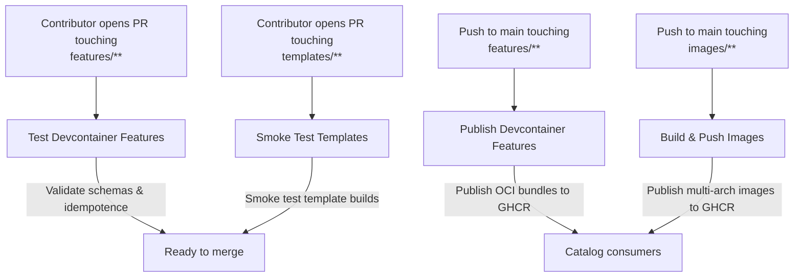
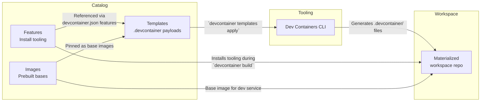

# Airnub DevContainers Catalog

**Primitives:**
- **Features** → install tooling (Supabase CLI, Node, CUDA, etc.). No services, idempotent.
- **Templates** → ship a ready-to-use `.devcontainer/` payload (can be multi-container via Compose).
- **Images** → prebuilt base(s) to speed builds.

> There’s no formal **“Stack”** object in the devcontainers spec. In this catalog, a **stack** is just a **flavor of Template** that combines features + sidecars + ports into a tested combo.

## What’s in this repo

- `features/` — install-only, idempotent. No services.
- `templates/` — opinionated dev environments. Includes **stack templates** (e.g., `stack-nextjs-supabase-webtop`).
- `images/` — optional prebuilt bases to accelerate `dev` service startup.
- `docs/` — spec alignment, architecture, publish/test pipelines.

## Using stacks (templates)

You can **materialize** a template’s payload (`.template/.devcontainer/*`) into a workspace repo, or reference a prebuilt image + features.

**Examples:**
- `templates/stack-nextjs-supabase-webtop/`
- `templates/stack-web-node-supabase-webtop/`

Each stack template specifies:
- `dockerComposeFile` (e.g., `dev` + `redis` + GUI sidecar `webtop`/`novnc`)
- port labels (9222 CDP, 3001/6080 desktop, 6379 Redis)
- feature set (Node, Supabase CLI, agent-tooling CLIs, etc.)

## Where do Supabase/Redis live?

- In **stack templates** via Compose sidecars and/or CLI-managed local via a Feature and `postStart` helper.
- Prefer Supabase **CLI-managed local**; provide a separate template flavor for a fully containerized Supabase stack when needed.

## Minimal taxonomy

- **Feature** = “Install this tool.”
- **Template** = “Bring these containers + ports + policies together.”
- **Image** = “Prebaked base for the dev container (optional).”
- **Stack** = “An opinionated Template (plus optional matching Image) with a tested combo: Node + pnpm + Redis + Supabase + GUI + CDP.”

## Canonical GHCR Namespaces

| Asset type | Example | Notes |
| --- | --- | --- |
| Feature | `ghcr.io/airnub-labs/devcontainer-features/supabase-cli:1` | Published per feature folder via `publish-features.yml`. |
| Template / Stack | `ghcr.io/airnub-labs/devcontainer-templates/stack-web-node-supabase-webtop:1.0.0` | Template IDs double as stack IDs (prefixed with `stack-`). |
| Image | `ghcr.io/airnub-labs/devcontainer-images/dev-web:1` | Multi-arch builds cut by `build-images.yml` with `:latest` and major tags. |

## Reproducibility

Each template may include a `stack.lock.json` (or README table) pinning feature versions and image digests.

## Consumption examples

```jsonc
{
  "image": "ghcr.io/airnub-labs/devcontainer-images/dev-web:1",
  "features": {
    "ghcr.io/airnub-labs/devcontainer-features/supabase-cli:1": {},
    "ghcr.io/airnub-labs/devcontainer-features/chrome-cdp:1": { "port": 9222 }
  }
}
```

```bash
# Materialize a stack template
devcontainer templates apply \
  --template-id ghcr.io/airnub-labs/devcontainer-templates/stack-web-node-supabase-webtop:1.0.0
```

## Publish & Test

- GitHub Actions publish **Features**, **Templates/Stacks**, and **Images** to GHCR, and test **Templates** by materializing their payloads and running smoke checks.

### Workflow Topology



### From Catalog Assets to a Workspace


