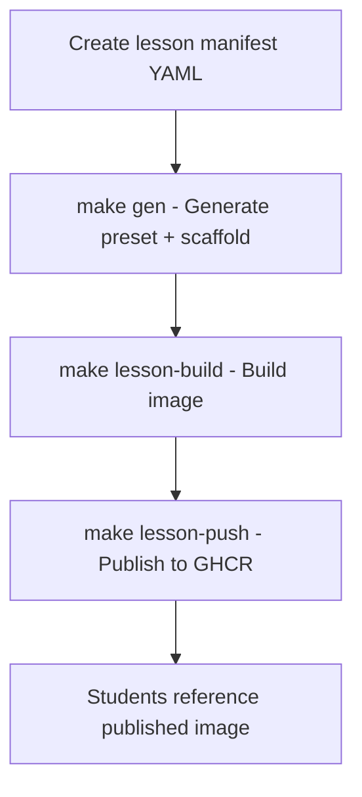
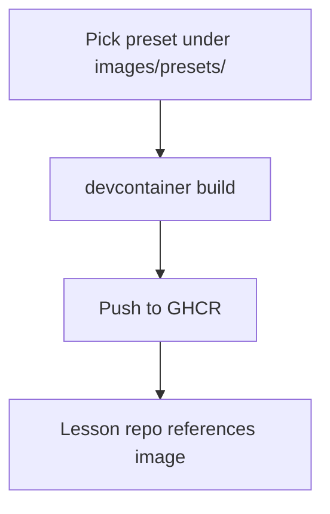

# Classroom Quick Start Guide

> Fast-start classroom environments: Instructor prebuilds once → Students pull instantly

This guide shows instructors how to create fast-loading development environments for students. Build a lesson environment once, validate it, then students launch Codespaces (or local Dev Containers) that pull a prebuilt image — **no waiting for tools to install**.

**Result:** Consistent, reproducible environments across the entire class with fast startup times.

---

## Table of Contents

- [Why This Approach is Fast](#why-this-approach-is-fast)
- [Two Approaches](#two-approaches)
- [Approach 1: Manifest-Driven (Recommended)](#approach-1-manifest-driven-recommended)
- [Approach 2: Direct Preset Build](#approach-2-direct-preset-build)
- [Student Experience](#student-experience)
- [Troubleshooting](#troubleshooting)
- [FAQ](#faq)

---

## Why This Approach is Fast

**Traditional approach (slow):**
- Each student's Codespace installs Features (Node, Python, pnpm, Jupyter, etc.)
- Installation takes 3-10 minutes per student
- Inconsistent timing, potential failures

**Prebuilt approach (fast):**
- Instructor builds image once with all tools baked in
- Students pull the prebuilt image (30-60 seconds)
- Identical environments guaranteed
- Dev Container Features already installed

**Key benefit:** Skip the per-Codespace installation step that can take minutes per student.

---

## Two Approaches

Choose based on your workflow:

### Approach 1: Manifest-Driven (Recommended)

**Best for:**
- Complex lessons with multiple services
- Standardized course environments
- Repeatable builds across semesters

**Workflow:**


### Approach 2: Direct Preset Build

**Best for:**
- Simple, one-off environments
- Quick experimentation
- Flexibility without manifest overhead

**Workflow:**


---

## Approach 1: Manifest-Driven (Recommended)

### Step 1: Describe the Lesson

Create or copy a lesson manifest:

```bash
cp examples/lesson-manifests/intro-ai-week02.yaml examples/lesson-manifests/my-lesson.yaml
```

Edit the manifest (`my-lesson.yaml`):

```yaml
metadata:
  org: "my-university"
  course: "cs101"
  lesson: "week01"

spec:
  base_preset: "full"  # Options: node-pnpm, python, full

  vscode:
    extensions:
      - dbaeumer.vscode-eslint
      - esbenp.prettier-vscode
    settings:
      telemetry.telemetryLevel: "off"

  services:  # Optional
    - redis
    - supabase
    # Also available: kafka, prefect, airflow, dagster, temporal

  secrets_placeholders:  # Optional
    - SUPABASE_PROJECT_REF
    - REDIS_PASSWORD
```

**Key fields:**
- `base_preset`: Choose from `images/presets/` (node-pnpm, python, full)
- `vscode.extensions`: VS Code extensions to include
- `services`: Optional services (Redis, Supabase, Kafka, orchestrators)
- `secrets_placeholders`: Secrets students will need to provide

### Step 2: Generate Preset + Scaffold

```bash
make gen LESSON_MANIFEST=examples/lesson-manifests/my-lesson.yaml
```

This creates:

```
images/presets/generated/my-university-cs101-week01/
├── devcontainer.json           # Build context for lesson image
├── GENERATION_SUMMARY.md       # Summary of what was generated
├── secrets.placeholders.env    # Template for required secrets
└── docker-compose.classroom.yml # (if services requested)

templates/generated/my-university-cs101-week01/
└── .devcontainer/
    └── devcontainer.json       # Student repo scaffold
```

**Generated artifacts:**
- **Preset context** (`images/presets/generated/<slug>/`) - Used to build the lesson image
- **Repo scaffold** (`templates/generated/<slug>/`) - Copy into student repository
- **Generation summary** - Recap of features, services, secrets
- **Secrets template** - Copy to `.env` or wire into Codespaces secrets
- **Compose file** - (If services) Launch all services with one command

### Step 3: Build and Publish Lesson Image

```bash
# Build multi-arch image (amd64 + arm64)
make lesson-build LESSON_MANIFEST=examples/lesson-manifests/my-lesson.yaml

# Push to GitHub Container Registry
make lesson-push LESSON_MANIFEST=examples/lesson-manifests/my-lesson.yaml
```

This publishes to: `ghcr.io/airnub-labs/templates/lessons/<lesson-slug>:<tag>`

**Multi-arch matters:** The workflow builds for both `linux/amd64` and `linux/arm64` so Apple Silicon laptops and cloud Codespaces pull the same image.

### Step 4: Wire Student Repositories

**Fast path:** Copy the generated scaffold:

```bash
# Copy scaffold into your lesson repository
cp -r templates/generated/my-university-cs101-week01/.devcontainer ./my-lesson-repo/
```

**Custom path:** Use the scaffold as a starting point and customize further.

**With services:** If you requested services, also copy the compose file:

```bash
cp images/presets/generated/my-university-cs101-week01/docker-compose.classroom.yml ./my-lesson-repo/
```

### Step 5: Keep Everything in Sync

- **Regenerate after manifest changes:** `make gen` is idempotent
- **Rebuild for base updates:** When base presets get security patches
- **Refresh services:** Periodically update vendored service fragments

**Note:** Generated artifacts under `images/presets/generated/` and `templates/generated/` are gitignored. Regenerate with `make gen` to review current outputs.

### Additional Make Targets

```bash
# Copy generated scaffold to specific location
make lesson-scaffold L=examples/lesson-manifests/my-lesson.yaml DEST=/tmp/lesson

# Bundle docker-compose + .env templates
make compose-aggregate L=examples/lesson-manifests/my-lesson.yaml DEST=dist/my-lesson-stack
```

---

## Approach 2: Direct Preset Build

### Step 1: Choose or Create a Preset

Pick an existing preset under `images/presets/`:

- **node-pnpm/** — Node 24 + pnpm
- **python/** — Python 3.12 (Jupyter optional)
- **full/** — Node + pnpm + Python + Jupyter

Or create your own preset folder for a custom stack.

### Step 2: Build & Publish to GHCR

**One-time login:**

```bash
echo $GITHUB_TOKEN | docker login ghcr.io -u <your-gh-username> --password-stdin
```

**Build & push** (example: full preset):

```bash
devcontainer build \
  --workspace-folder images/presets/full \
  --image-name ghcr.io/airnub-labs/templates/full:ubuntu-24.04 \
  --push
```

**Tagging tips:**
- Use stable tags (`:ubuntu-24.04`) for semester-wide baselines
- Use date/version tags (`:v2025.10.29`) for lesson-specific locks

### Step 3: Create Lesson Repository Config

Add a minimal `.devcontainer/devcontainer.json` that references the prebuilt image:

```json
{
  "name": "lesson-01",
  "image": "ghcr.io/airnub-labs/templates/full:ubuntu-24.04",
  "workspaceFolder": "/work",
  "customizations": {
    "vscode": {
      "settings": {
        "remote.downloadExtensionsLocally": "always",
        "telemetry.telemetryLevel": "off"
      },
      "extensions": [
        "dbaeumer.vscode-eslint",
        "esbenp.prettier-vscode"
      ]
    }
  }
}
```

**You can still customize per-repo:**
- Add repo-specific extensions
- Custom settings, tasks, post-commands
- Heavy tooling (Node/Python/pnpm) is already in the image

### Step 4: Share with Students

**GitHub Codespaces:**
- Students click "Code → Create codespace on main"

**Local Dev Containers:**
- Students use "Dev Containers: Reopen in Container" in VS Code

The container pulls the prebuilt image and starts quickly. No long Feature reinstalls.

### Optional: Automate with CI

Automate pushes to GHCR using GitHub Actions:

```yaml
name: publish-preset-images

on:
  workflow_dispatch:
  push:
    branches: [ main ]
    paths:
      - "images/presets/**"

jobs:
  build-and-push:
    runs-on: ubuntu-latest
    permissions:
      contents: read
      packages: write
    steps:
      - uses: actions/checkout@v4

      - name: Build and push full preset
        run: |
          devcontainer build \
            --workspace-folder images/presets/full \
            --image-name ghcr.io/airnub-labs/templates/full:ubuntu-24.04 \
            --push
```

You can matrix the job for multiple presets (node-pnpm, python, etc.).

---

## Student Experience

### What Students See

1. **Open the lesson repo** (Codespaces or local Dev Containers)
2. **Container pulls** `ghcr.io/airnub-labs/templates/<preset>:<tag>`
3. **VS Code opens** with expected extensions/settings
4. **They're coding** within ~30-60 seconds

### Local Development vs Codespaces

**Codespaces:**
- Best for classrooms
- No local Docker required
- Consistent cloud environment

**Local Dev Containers:**
- Works identically
- Requires Docker + VS Code + Dev Containers extension
- Image pulled locally via Docker

**For labs:** Admin can pre-pull GHCR image to local registry to reduce first-pull time.

---

## Advanced: Browser Options

### Full Graphical Chrome

**Neko (WebRTC):** `templates/classroom-neko-webrtc`
- Default TCP-mux works through Codespaces proxy
- For home labs, enable UDP range and STUN/TURN

**Kasm Chrome (KasmVNC):** `templates/classroom-kasm-chrome`
- Pure HTTPS + WebSocket transport
- Very proxy-friendly
- Increase `shm_size` for heavy devtools/media testing

### Generic Stack with Selectable Browsers

Use `stack-nextjs-supabase-browsers` and pick any combination:
- Neko Chrome
- Neko Firefox
- Kasm Chrome

**Network access:** All sidecars can reach your app via `http://devcontainer:3000`. Bind dev server to `0.0.0.0`.

---

## Troubleshooting

### It's still slow / Features are installing

**Check:** Your lesson repo's `.devcontainer/devcontainer.json`
- Must use `"image": "ghcr.io/..."`
- NOT `"features": { ... }` for the same tools

**Debug:**
- Open container logs
- Look for "installing Feature …"
- This means repo asks to install Features at runtime

**Fix:** Reference the prebuilt image, don't redeclare Features.

### Extensions re-install each time

**Ensure:** `"remote.downloadExtensionsLocally": "always"` in `customizations.vscode.settings`

**Avoid:** Installing same extension in multiple places (templates + scripts). Stick to `devcontainer.json` lists.

### Image cannot be pulled

**Check:**
- Image is public in GHCR or students have access
- Spelling: `ghcr.io/airnub-labs/templates/<preset>:<tag>`
- Test locally: `docker pull ghcr.io/airnub-labs/templates/full:ubuntu-24.04`

**Verify access:** Students may need to authenticate to GHCR for private images.

### Need a quick fallback

Use template scaffold (copy from `templates/`) — it will work, just slower on first run as Features install.

---

## FAQ

**Q: Can we customize per-repo after using an image?**

A: Yes! Add repo-specific settings/extensions/tasks to that repo's `.devcontainer/devcontainer.json`. Just avoid re-declaring Features already baked into the image.

---

**Q: Do students need Docker locally?**

A: Not for Codespaces. For local Dev Containers, yes — plus VS Code + Dev Containers extension.

---

**Q: How often should we rebuild images?**

A: As needed. For a stable course, use a locked tag (e.g., `:v2025.10`). Rebuild only when you change the toolchain or base updates arrive.

---

**Q: Can we pin exact versions of Node/Python/pnpm?**

A: Yes — set versions in the preset's `devcontainer.json` (uses Dev Container Features), then rebuild the image.

---

**Q: What's the difference between templates/ and images/presets/?**

A:
- **templates/** = Scaffolds you copy into a repo (editable, flexible, slower first boot)
- **images/presets/** = Prebuildable image presets (fast boot, consistent)

---

**Q: Can we use both approaches?**

A: Yes! Use manifest-driven for standardized courses, direct preset build for quick experiments or special cases.

---

## Recap

✅ **Instructor builds once** → **Students pull**: Consistent, fast, zero-setup classrooms

✅ **templates/** = scaffold you copy. **images/presets/** = image you prebuild & publish

✅ Use **`"image": "ghcr.io/..."`** in student repos for instant start

✅ **Manifest-driven** for complex, repeatable lessons. **Direct preset** for simple, flexible setups.

---

## Related Documentation

- **[Lesson Manifest Schema](../reference/manifest-schema.md)** - Detailed manifest specification
- **[Services Reference](../reference/services.md)** - Available services (Redis, Supabase, etc.)
- **[MVP Strategy](../mvp/README.md)** - Current strategic direction
- **[Catalog Design](../architecture/catalog-design.md)** - Features, templates, images reference

---

**Happy teaching!** 🎓🚀

**Last Updated:** 2025-11-02 (Phase 4: Consolidate Duplicates)
