Quick Start — Classroom Fast-Start (Instructor prebuild → Students pull)

Goal: The instructor builds a dev environment once, validates it, then students open Codespaces (or local Dev Containers) that pull a prebuilt image — no waiting for Features (Node, Python, pnpm, Jupyter, etc.) to re-install.

TL;DR for instructors

Pick a preset under images/presets/ (e.g., full for Node+pnpm+Python).

Build & publish it to GHCR:

```bash
devcontainer build \
  --workspace-folder images/presets/full \
  --image-name ghcr.io/airnub-labs/templates/full:ubuntu-24.04 \
  --push
```

In your lesson repo, add a minimal .devcontainer/devcontainer.json that references the image:

{
  "name": "lesson-01",
  "image": "ghcr.io/airnub-labs/templates/full:ubuntu-24.04",
  "workspaceFolder": "/work",
  "customizations": {
    "vscode": {
      "settings": { "remote.downloadExtensionsLocally": "always" },
      "extensions": [ "dbaeumer.vscode-eslint", "esbenp.prettier-vscode" ]
    }
  }
}

Tell students: “Open in Codespaces” (or use “Dev Containers: Reopen in Container” locally).
It will pull the prebuilt image and start fast. ✅

Why this is fast

Dev Container Features (Node, Python, pnpm, Jupyter) are already baked inside the prebuilt image.

Students skip the per-Codespace installation step, which can take minutes per student.

You get consistent, reproducible environments across the entire class.

Key concepts
Source vs Artifact

templates/ → Dev Container Templates (scaffolds) you copy into a repo.

Editable per-repo; flexible but first boot is slower (Features may install).

images/presets/ → Prebuildable image presets (each has a devcontainer.json).

Use devcontainer build to bake & push an OCI image to GHCR.

External workspaces then reference the image via "image": "ghcr.io/..." → fast boot.

If your repository still uses images/templates/, the steps are identical — just substitute that path. We recommend the images/presets/ name to avoid confusion with templates/.

## Choose your path

```mermaid
flowchart TB
  A[Preset Mode — fast boot] --> B[Pick preset under images/presets]
  B --> C[devcontainer build --workspace-folder images/presets/<preset>]
  C --> D[Push to ghcr.io/airnub-labs/templates/<preset>:<tag>]
  D --> E[Lesson repo references the published image]
```



```mermaid
flowchart TB
  A[Template Mode — flexible scaffold] --> B[Copy template from templates/*]
  B --> C[Edit .devcontainer/devcontainer.json for repo-specific needs]
  C --> D[First boot installs Features on demand (slower)]
```

## Lesson manifest one-liners

The Makefile now wraps the generator so you can go from a manifest to artifacts without memorising long commands:

```bash
# Generate preset context + scaffold
make gen L=examples/lesson-manifests/intro-ai-week02.yaml

# Build/push the lesson image (multi-arch with provenance)
make lesson-build L=examples/lesson-manifests/intro-ai-week02.yaml
make lesson-push  L=examples/lesson-manifests/intro-ai-week02.yaml

# Copy the generated repo scaffold somewhere (e.g., to inspect or commit)
make lesson-scaffold L=examples/lesson-manifests/intro-ai-week02.yaml DEST=/tmp/lesson

# Bundle docker-compose.classroom.yml plus .env.example-* files for services
make compose-aggregate L=examples/lesson-manifests/intro-ai-week02.yaml DEST=dist/intro-ai-week02-stack
```

`DEST` is optional for `compose-aggregate`; if omitted the bundle lands under `dist/<slug>/classroom/`.

Step-by-step: Instructor flow
1) Choose or create a preset

Pick one of the existing presets under images/presets/:

node-pnpm/ — Node 24 via Feature, pnpm enabled

python/ — Python 3.12 via Feature (Jupyter optional)

full/ — Node + pnpm + Python (with Jupyter)

Each preset contains a devcontainer.json tailored for that stack.

You can also create your own preset folder if your course needs a special stack.

2) Build & publish to GHCR

Log in to GHCR (one-time):

echo $GITHUB_TOKEN | docker login ghcr.io -u <your-gh-username> --password-stdin

Build & push (example: full preset):

```bash
devcontainer build \
  --workspace-folder images/presets/full \
  --image-name ghcr.io/airnub-labs/templates/full:ubuntu-24.04 \
  --push
```

Tagging tips:

Use a stable tag (e.g., :ubuntu-24.04) for a semester-wide baseline.

Or date/version tags (e.g., :v2025.10.29) for lesson-specific locks.

3) Create or update the lesson repo

Add a minimal .devcontainer/devcontainer.json pointing at the prebuilt image:

```json
{
  "name": "lesson-01",
  "image": "ghcr.io/airnub-labs/templates/full:ubuntu-24.04",
  "workspaceFolder": "/work",
  "customizations": {
    "vscode": {
      "settings": {
        "remote.downloadExtensionsLocally": "always",
        "telemetry.telemetryLevel": "off"
      },
      "extensions": [
        "dbaeumer.vscode-eslint",
        "esbenp.prettier-vscode"
      ]
    }
  }
}
```

You can still add repo-specific extensions, settings, tasks, or post-commands here.
The heavy tooling (Node/Python/pnpm/Jupyter) is already in the image.

4) Share with students

GitHub Codespaces: Students click “Code → Create codespace on main”.

Local Dev Containers: Students use “Dev Containers: Reopen in Container” in VS Code.

The container pulls the prebuilt image and starts quickly. No long Feature reinstalls.

Student flow (what they see)

Open the lesson repo (Codespaces or local Dev Containers).

Container pulls ghcr.io/airnub-labs/templates/<preset>:<tag>.

VS Code opens with the expected extensions/settings.

They’re coding within ~seconds to a minute (depending on image size and network).

CI: Publish on push (optional)

You can automate pushes to GHCR using GitHub Actions (example for the full preset):

```yaml
name: publish-template-images

on:
  workflow_dispatch:
  push:
    branches: [ main ]
    paths:
      - "images/presets/**"

jobs:
  build-and-push:
    runs-on: ubuntu-latest
    permissions:
      contents: read
      packages: write
    steps:
      - uses: actions/checkout@v4
      - uses: devcontainers/ci@v0.3
        with:
          runCmd: |
            devcontainer build \
              --workspace-folder images/presets/full \
              --image-name ghcr.io/airnub-labs/templates/full:ubuntu-24.04 \
              --push
```

You can add additional steps for node-pnpm and python presets or matrix the job.

Local development vs Codespaces

Codespaces: Best for classrooms; students don’t need local installs.

Local Dev Containers: Works the same; the image is pulled locally via Docker.

For labs with many machines, an admin can pre-pull the GHCR image to a local registry or each machine to reduce first-pull time.

Troubleshooting

It’s still slow / Features are installing

Check your lesson repo’s .devcontainer/devcontainer.json: it must use "image": "ghcr.io/..." not "features": { ... } for the same tools.

Open the container logs; look for “installing Feature …” — that means your repo still asks to install Features at runtime.

Extensions re-install each time

Keep "remote.downloadExtensionsLocally": "always" in customizations.vscode.settings.

Avoid installing the same extension in multiple places (templates + scripts). Stick to devcontainer.json lists.

Image cannot be pulled

Ensure the image is public in GHCR or students have access.

Check spelling: ghcr.io/airnub-labs/templates/<preset>:<tag>.

Try docker pull ghcr.io/airnub-labs/templates/full:ubuntu-24.04 locally to verify access.

Need a quick fallback

Use the template scaffold (copy from templates/) — it will work, just slower on first run.

FAQ

Q: Can we still customize per-repo after using an image?
A: Yes. Add repo-specific settings/extensions/tasks to that repo’s .devcontainer/devcontainer.json. Just avoid re-declaring Features already baked into the image.

Q: Do students need Docker locally?
A: Not for Codespaces. For local Dev Containers, yes — plus VS Code + Dev Containers extension.

Q: How often should we rebuild images?
A: As needed. For a stable course, use a locked tag (e.g., :v2025.10). Rebuild only when you change the toolchain.

Q: Can we pin exact versions of Node/Python/pnpm?
A: Yes — set versions in the preset’s devcontainer.json (which uses Dev Container Features under the hood), then rebuild the image.

Appendix: Makefile convenience (optional)

Add a Makefile to the repo for repeatable builds:

.PHONY: build-full push-full build-node push-node build-python push-python

REGISTRY ?= ghcr.io/airnub-labs/templates
TAG      ?= ubuntu-24.04

build-full:
devcontainer build --workspace-folder images/presets/full --image-name $(REGISTRY)/full:$(TAG)

push-full: build-full
devcontainer build --workspace-folder images/presets/full --image-name $(REGISTRY)/full:$(TAG) --push

build-node:
devcontainer build --workspace-folder images/presets/node-pnpm --image-name $(REGISTRY)/node-pnpm:$(TAG)

push-node: build-node
devcontainer build --workspace-folder images/presets/node-pnpm --image-name $(REGISTRY)/node-pnpm:$(TAG) --push

build-python:
devcontainer build --workspace-folder images/presets/python --image-name $(REGISTRY)/python:$(TAG)

push-python: build-python
devcontainer build --workspace-folder images/presets/python --image-name $(REGISTRY)/python:$(TAG) --push

Recap

Instructor builds once → Students pull: consistent, fast, zero-setup classrooms.

templates/ = scaffold you copy. images/presets/ = image you prebuild & publish.

Use "image": "ghcr.io/..." in student repos for instant start.

Happy teaching! 🎓🚀
